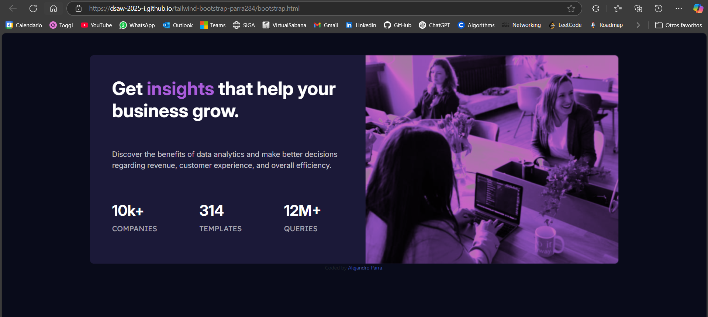

# Stats preview card component solution

## Name: Alejandro Parra

## Table of contents

- [Overview](#overview)
  - [The challenge](#the-challenge)
  - [Screenshot](#screenshot)
  - [Links](#links)
- [Author](#author)

**Note: Delete this note and update the table of contents based on what sections you keep.**

## Overview

### The challenge

Users should be able to:

- View the optimal layout depending on their device's screen size, using **bootstrap** and **tailwind**, so you must create two different routes.
- One for bootstrap: `/bootstrap`
- One for tailwind: `/tailwind`

### Screenshot

**Note: Delete this note and the paragraphs above when you add your screenshot. If you prefer not to add a screenshot, feel free to remove this entire section.**

### Links

- Solution URL: [Solution URL](https://dsaw-2025-i.github.io/tailwind-bootstrap-parra284/)
